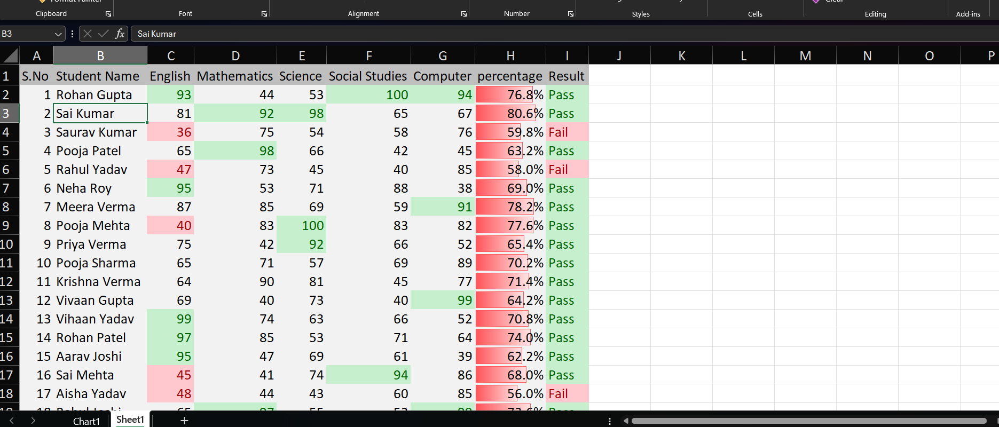

# excel-conditional-formatting
My Microsoft Excel Conditional Formatting Practice Project

# 📊 Student Marks Analysis in Microsoft Excel

## 📌 Overview

This project demonstrates how Microsoft Excel can be used to analyze student marks using formulas and Conditional Formatting.

## 🎯 Project Objective

The goal of this project is to visualize student performance and automatically identify pass/fail status based on marks.

## 📁 Dataset

- Student Names
- English
- Mathematics
- Science
- Social Studies
- Computer
- Percentage
- Result

## 🛠 Tools Used

- Microsoft Excel

## ✨ Features

- ✅ Conditional Formatting
- ✅ Percentage Calculation
- ✅ Pass/Fail Result
- ✅ Highlight High & Low Marks
- ✅ Color Coding for Better Visualization

## 📷 Project Preview

## 📚 Skills Demonstrated

- Data Analysis
- Data Visualization
- Excel Formulas
- Conditional Formatting
- Percentage Calculation

## 👨‍💻 Author

Saurav
